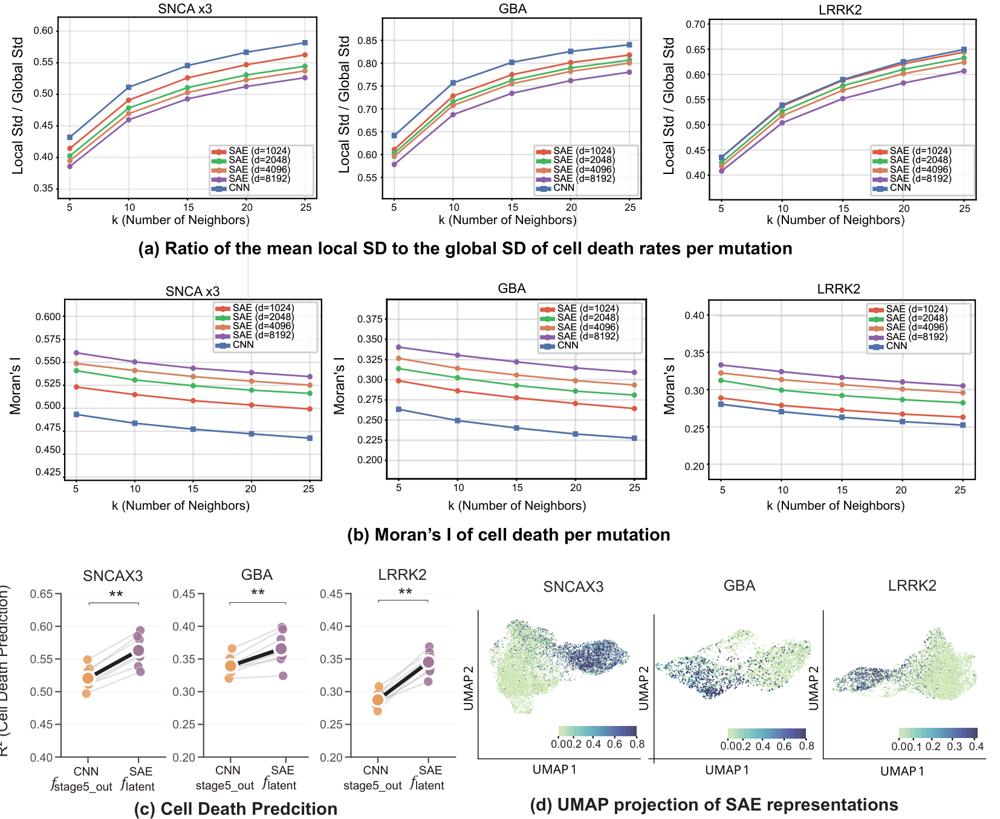
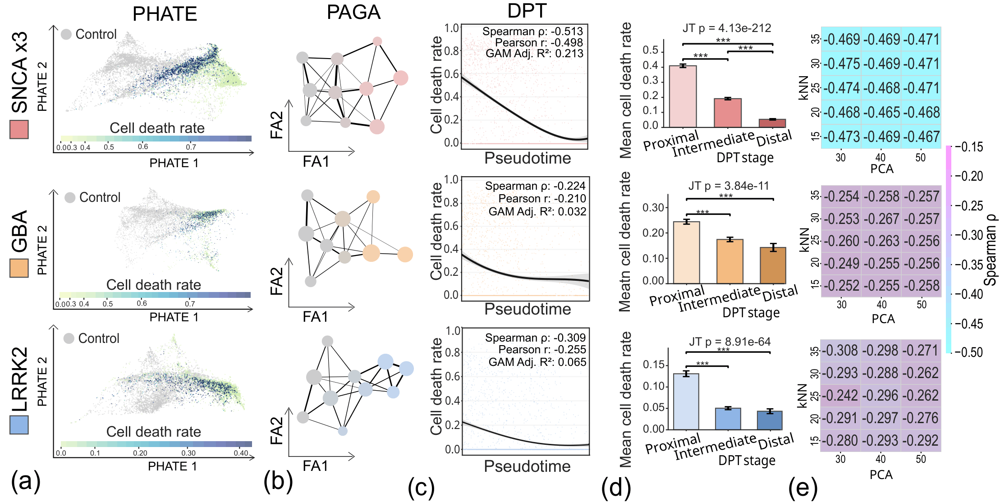
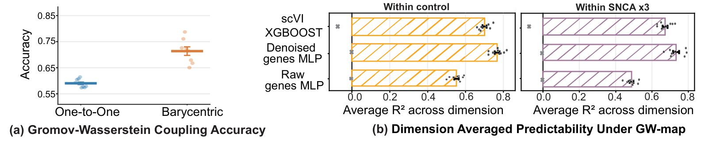

# Superposition contaminates representation metric sapce beyond hindering interpretability.

This repository is the official implementation of **“Resolving superposition in AI for
interpretability and cross-modal alignment in patient-neuronal images”**

[](https://arxiv.org/abs/2606.31394v1)


> The code and documentation are currently being organized and will be updated progressively.


## Overview


Superposition means that neural network compresses multiple distinct concepts into fewer dimensions due to the dimensional bottleneck. We find that superposition contaminates the model representations metric space. Given that extreme high-dimensionality and zero-inflated sparsity are inherent to biological data, this geometric corruption is pronounced in biological AI, fundamentally threatening the reliability of prevalent representation-based downstream analyses.
Therefore, although superposition has been critically overlooked in biological AI, superposition demands further attention.

We utilized gated sparse autoencoder (SAE) to resolve the superposition. By using geometrically purified SAE representaion, we deployed single-cell RNA sequencing (scRNA-seq) analysis methodologeis to evaluate the SAE representations. Intriguingly, the L0/L1 regularization imposed on SAEs mathematically mirrors the evolutionary constraints of energy-efficient, sparse molecular expression, yielding similarly skewed, zero-inflated activation distributions. This structural similarity justify the adaptation of scRNA-seq methodologies. Finally we , we developed GW-map, utilizing Gromov-Wasserstein optimal transport to align these image representationswith authentic scRNA-seq data de novo.


<div align="center">
  
</div>

## Superposition Contamination

To verify this framework, we quantify the semantic similarity through the standard deviation of cell death rate.

<div align="center">
  
</div>


## Adaptation of scRNA-seq analysis method

SAE representation faithfully reflects the data intrinsic sturcture by disentangling the superposition. Intriguingly, the L0/L1 regularization imposed on SAEs
mathematically mirrors the evolutionary constraints of energy-efficient, sparse molecular expression, yielding similarly skewed, zero-inflated activation distributions. Leveraging this geometric purification and structural similarity,
we directly adapted scRNA-seq analytical frameworks to the image domain

<div align="center">
  
</div>


## GW-map
We introduce GW-map, coupling the image and authentic scRNA-seq via gromov-wasserstein. High label transfer accuracy and predictability indicates the robust coupling.


<div align="center">
  
</div>


## Code Implementation

### Hardware & Requirements

We used 1x NVIDIA GH200 (96 GB), ARM64 + H100, 64 vCPUs, 432 GiB RAM, and a 4 TiB SSD for CNN and SAE training.

```bash
conda create -n our_model python=3.12 -y
conda activate our_model
pip install -r requirements.txt
```

### Reproducing the Paper's Results
You can reproduce the main results and figures of our paper by running the provided bash scripts sequentially:

*   **Data preprocessing**
    ```bash
    bash script/01_preprocessing.sh
    ```

*   **Figure 2. CNN training and evaluation:**
    ```bash
    bash script/02_run_cnn_models.sh
    ```
*   **Table 1, Figure 3. SAE training and evaluation:**
    ```bash
    bash script/03_SAE.sh
    ```
*   **Figure 5. Geometric contamination analysis:**
    ```bash
    bash script/04_geometric_contamination.sh
    ```
*   **Figure 6. scRNA-seq analysis adaptation:**
    ```bash
    bash script/05_scRNA_adapt.sh
    ```  


### Model Training Details
The above bash scripts automatically execute the training routines. For reference, the core Python commands and hyperparameters used for our models are as follows:

For CNN training
```bash
python -m run_CNN.train \
    --epochs 100 \
    --batch_size 512 \
    --moco_m 0.995 \
    --temp 0.07 \
    --use_bf16 \
    --lr 0.1 \
    --sgd_nesterov \
    --symmetric_loss \
    --queue_dtype_fp16
```  

For SAE training on CNN:
```bash
python -m sae_project.step09_train_gated_sae \
    --model_state_path "${MODEL_DIR}/best_model.pt" \
    --use_bf16 \
    --batch_size 64 \
    --epochs 8 \
    --d_sae 8192 \
    --final_sparsity_coeff 800 \
    --tie_gate_weights
```  


