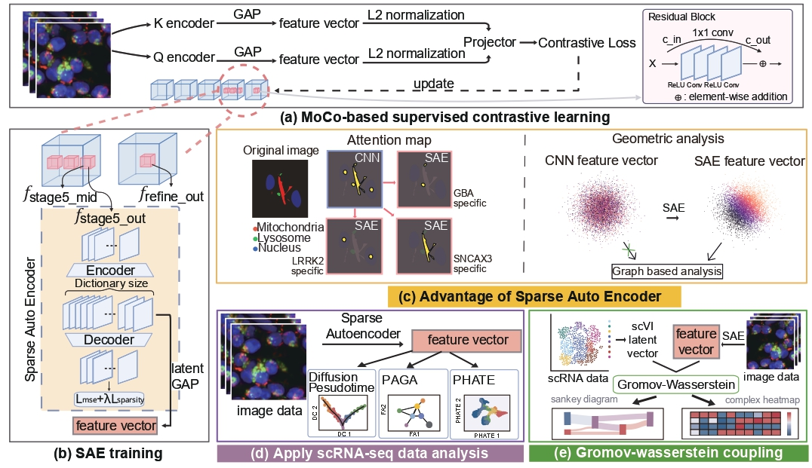

# Superposition contaminates representation metric sapce beyond hindering interpretability.

This is the official github repo for the paper [Resolving superposition in AI for
interpretability and cross-modal alignment in patient-neuronal images]


## Overview


Superposition means that neural network compresses multiple distinct concepts into fewer dimensions due to the dimensional bottleneck. We find that superposition contaminates the model representations metric space. Given that extreme high-dimensionality and zero-inflated sparsity are inherent to biological data, this geometric corruption is pronounced in biological AI, fundamentally threatening the reliability of prevalent representation-based downstream analyses.
Therefore, although superposition has been critically overlooked in biological AI, superposition demands further attention.

We utilized gated sparse autoencoder (SAE) to resolve the superposition. By using geometrically purified SAE representaion, we deployed single-cell RNA sequencing (scRNA-seq) analysis methodologeis to evaluate the SAE representations. Intriguingly, the L0/L1 regularization imposed on SAEs mathematically mirrors the evolutionary constraints of energy-efficient, sparse molecular expression, yielding similarly skewed, zero-inflated activation distributions. This structural similarity justify the adaptation of scRNA-seq methodologies. Finally we , we developed GW-map, utilizing Gromov-Wasserstein optimal transport to align these image representationswith authentic scRNA-seq data de novo.


<div align="center">
  
</div>


## The toy model

We use Anthropic's toy model of superposition, adding weight decay or growth to control the degree of superposition.

<p align="center" width="100%">

</p>

## Weight decay

Weight decay (or growth when the value is negative) can control superposition reflected by the fraction of represented features.

The code of the following figure is ['./exp/exp-10.py'](./exp/exp-10.py) and ['./exp/exp-10-3.py'](./exp/exp-10-3.py)

<p align="center" width="100%">

</p>

## Rich phenomena

We need to answer when the loss is a power law with model dimension, and what control the power law exponent (we call it model exponent here).

We analyze the data from ['./exp/exp-17.py'](./exp/exp-17.py), ['./exp/exp-10.py'](./exp/exp-10.py) and ['./exp/exp-10-3.py'](./exp/exp-10-3.py) in the following figure.

<p align="center" width="100%">

</p>

## Weak superposition regime

In the weak superposition regime (weight decay is large), the loss is well described by the expected number of activated but unlearned features, which is a power law once the feature distribution is.

The data are from ['./exp/exp-10.py'](./exp/exp-10.py) and ['./exp/exp-10-3.py'](./exp/exp-10-3.py).

<p align="center" width="100%">

</p>

## Strong superposition

Scaling behavior in the strong superposition regime is robust due to generic geometric fact that when many more vectors are squeezed into a lower dimensional space, their overlaps scale inversely proportional to square root of dimension.

The data are from ['./exp/exp-10.py'](./exp/exp-10.py) and ['./exp/exp-10-3.py'](./exp/exp-10-3.py).

<p align="center" width="100%">

</p>

## Activation density

The scaling exponents are robust to the number of expected activated features in one data point.

The data are from ['./exp/exp-15.py'](./exp/exp-15.py).

<p align="center" width="100%">

</p>

## LLMs

LLMs agree with the toy model results in the strong superposition regime from underlying overlaps between representations to loss scaling with model dimension.

Analysis of overlaps is in ['./LLMs/overlap-0.py'](./LLMs/overlap-0.py). We also analyzed norm distribution in ['./LLMs/norm-0.py'](./LLMs/norm-0.py) and token frequencies in ['./LLMs/token-freq-0.py'](./LLMs/token-freq-0.py) (see Appendix in the paper). Loss evaluation can be found in ['./LLMs/cali-1.py'](./LLMs/cali-1.py).

<p align="center" width="100%">

</p>

## Citation
```
@article{liu2025superposition,
  title={Superposition Yields Robust Neural Scaling},
  author={Liu, Yizhou and Liu, Ziming and Gore, Jeff},
  journal={Advances in Neural Information Processing Systems},
  volume={38},
  pages={159269--159305},
  year={2025}
}
```
or
```
@article{liu2025superposition,
  title={Superposition Yields Robust Neural Scaling},
  author={Liu, Yizhou and Liu, Ziming and Gore, Jeff},
  journal={arXiv preprint arXiv:2505.10465},
  year={2025}
}
```

## Interested in Other Neural Scaling Laws?

- Depth Scaling Due to Limited Transformation: Inverse Depth Scaling From Most Layers Being Similar ([paper link](https://arxiv.org/abs/2602.05970), [code link](https://github.com/liuyz0/DepthScaling))
- Time Scaling Due to Limited Training: Universal One-third Time Scaling in Learning Peaked Distributions ([paper link](https://arxiv.org/abs/2602.03685), [code link](https://github.com/liuyz0/TimeScaling))
